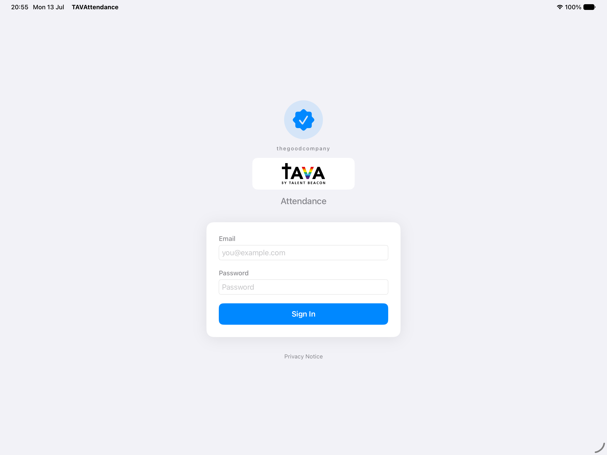

# TAVA Attendance — Staff Guide

A one-page guide for trying the app. No technical knowledge needed.
Keep this open on your phone while you set up.

---

## What the app is

TAVA Attendance is how the centre takes attendance.

- The **iPad** by the front desk is the **kiosk**. Students tap their own name to sign in.
- **Tutors** use the app on their phone or iPad to mark their class roster.
- **Admin staff** use the **website** to see reports and download attendance.

Everything syncs automatically. If the internet drops, the app keeps working and catches up later.

---

## 1. Setting up the kiosk iPad

1. Open the **TAVA Attendance** app on the iPad.
2. Sign in with the **admin account** (email + password given to you).

> **Important:** the kiosk iPad must ALWAYS be signed in with an **admin** account.
> A tutor account only sees its own classes, so the kiosk would be missing students.
> This is a rule, not a setting — if the kiosk looks empty, check you are signed in as admin.

3. Stand the iPad up at the front desk where students can reach it.

---

## 2. Students signing in (the kiosk)

The **Sign In** tab shows a card for every student with class today.

- **Tap a student's card** → they are signed in.
  - Card turns **green** = **On Time**.
  - Card turns **orange** = **Late** (they tapped after the class start time).
- **Not Here** — if a student is marked by mistake, an admin can set the card back to grey ("Not Here"). The student can then tap again to sign in.

Grey card = not signed in yet. Green = on time. Orange = late.

### Locking the kiosk (so students can't change things)

- Set a **PIN**: tap the **gear icon** → Kiosk Settings → Set PIN → **Lock Kiosk Now**.
- When locked, students only see the sign-in grid. No settings, no overrides.
- To make a change as staff: tap the **lock icon**, enter the PIN. An **ADMIN** badge appears.
- **Admin overrides** (only when unlocked): **press and hold** a student's card to:
  - change Late back to On Time,
  - mark a student **Absent** (red),
  - mark **Not Here**.
- Lock it again with the gear → **Lock Kiosk Now**.

> *Screenshot of the kiosk grid is omitted here — during your trial it shows student
> names, and we don't put names in shared documents. You'll see it live on the iPad.*

---

## 3. Tutors marking their class

On the tutor's device:

1. Go to **Classes** → pick your class → **Start Today's Class**.
2. Tap each student to mark them **Present**. You'll see **"Marked HH:MM"** under their name.
3. Tap a student's row to see their **profile and recent attendance**.
4. **No internet?** You can still mark students. A small **orange dot** appears next to a name that hasn't synced yet. When the internet is back, the dot disappears on its own — that means it saved.

> *Screenshot of the roster is omitted here for the same privacy reason (student names).*

---

## 4. The web dashboard (admin)

Open **dash.thegoodcompanysg.dev** in any browser and log in with your admin account.

- **Analytics** — today's sessions, attendance over time, and students to watch.
- **Export** — download attendance as a spreadsheet (CSV) for your records.

This is where you check that what happened on the iPad shows up correctly.

> *Dashboard screenshots are omitted here because they list student names.*

---

## If something goes wrong

- Take a **screenshot** of whatever is on screen (and note the time).
- Message **Edmund** with the screenshot and a line about what you did just before.
- The kiosk keeps working offline, so keep taking attendance — nothing is lost.
