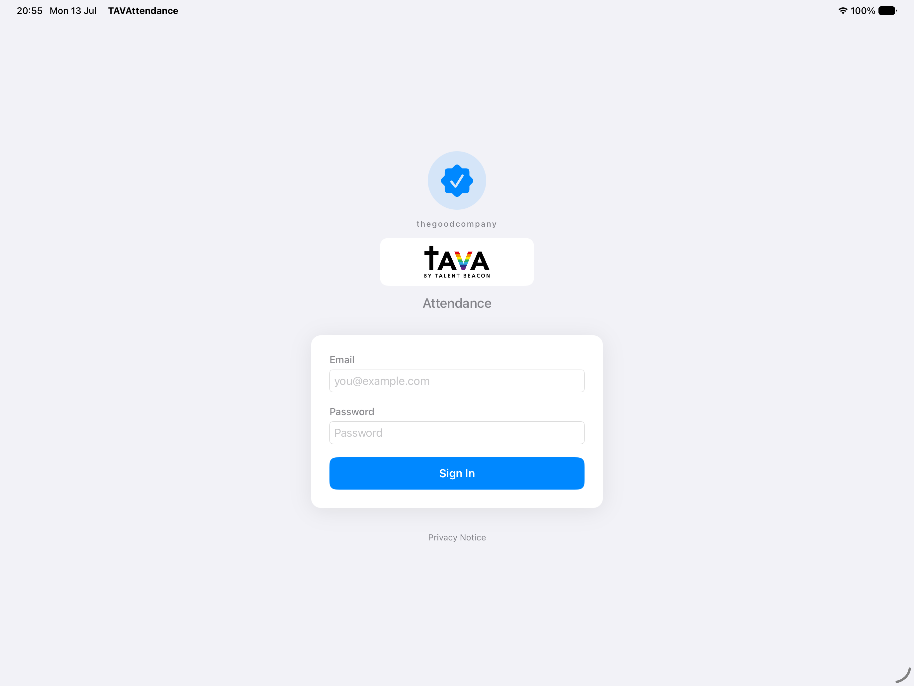

# TAVA Attendance — Staff Guide

A one-page guide for trying the app. No technical knowledge needed.
Keep this open on your phone while you set up.

---

## What the app is

TAVA Attendance is how the centre takes attendance.

- The **iPad** by the front desk is the **kiosk**. Students tap their own name to sign in.
- **Tutors** use the app on their phone or iPad to mark their class roster.
- **Admin staff** use the **website** to see reports and download attendance.

Attendance can be queued briefly if the internet drops. Do not assume it has
reached the server until the pending indicator clears and the dashboard agrees.

---

## 1. Setting up the kiosk iPad

1. Open the **TAVA Attendance** app on the iPad.
2. Sign in with the **admin account** (email + password given to you).

> **Important:** the kiosk iPad must ALWAYS be signed in with an **admin** account.
> A tutor account only sees its own classes, so the kiosk would be missing students.
> This is a rule, not a setting — if the kiosk looks empty, check you are signed in as admin.

3. Stand the iPad up at the front desk where students can reach it.
4. Confirm the iPad has an OS passcode, current updates, and no student can
   leave the TAVA app or view notification previews.

---

## 2. Students signing in (the kiosk)

The **Sign In** tab shows a card for every student with class today.

- **Tap a student's card** → they are signed in.
  - Card turns **green** = **On Time**.
  - Card turns **orange** = **Late** (they tapped after the class start time).
- **Not Here Yet** — if a student is marked by mistake, an admin can clear the mark and return the card to grey. The student can then tap again to sign in.

Grey card = Not Here Yet. Green = on time. Orange = late.

### Locking the kiosk (so students can't change things)

- Before students use it, set a **PIN**: tap the **gear icon** → Kiosk Settings
  → Set PIN → **Lock Kiosk Now**. Do not use the example PIN from the test
  script in production.
- When locked, students only see the sign-in grid. No settings, no overrides.
- To make a change as staff: tap the **lock icon**, enter the PIN. An **ADMIN** badge appears.
- **Admin overrides** (only when unlocked): **press and hold** a student's card to:
  - change Late back to On Time,
  - mark a student **Absent** (red),
  - mark **Not Here Yet**.
- Lock it again with the gear → **Lock Kiosk Now**.

> *Screenshot of the kiosk grid is omitted here — during your trial it shows student
> names, and we don't put names in shared documents. You'll see it live on the iPad.*

---

## 3. Tutors marking their class

On the tutor's device:

1. Go to **Classes** → pick your class → **Start Today's Class**.
2. Tap each student to mark them **Present**. You'll see **"Marked HH:MM"** under their name.
3. Tap a student's row to see their **profile and recent attendance**.
4. **No internet?** You can mark attendance for a short interruption. A small
   **orange dot** means the record is only pending on that signed-in device.
   Restore the connection promptly and keep the same staff account signed in.
   The dot must clear and the web dashboard must show the record before you
   treat it as saved. Ended sessions, records more than seven days old, account
   changes, or a damaged queue can reject pending work.

> *Screenshot of the roster is omitted here for the same privacy reason (student names).*

---

## 4. The web dashboard (admin)

Open **dash.thegoodcompanysg.dev** in any browser and log in with your admin account.

- **Analytics** — today's sessions, attendance over time, and students to watch.
- **Export** — download attendance as a spreadsheet (CSV) for your records.

This is where you check that what happened on the iPad shows up correctly.

> *Dashboard screenshots are omitted here because they list student names.*

---

## If something goes wrong

- Note the exact time, device, signed-in role, app version, screen and action.
- A screenshot may contain children's personal data. Send it only through the
  centre's approved private support channel; crop/redact unrelated names and
  never post it in a public/shared chat.
- If the wrong child's data appears, another account's pending records appear,
  or a device/account may be compromised: stop syncing, do not sign in as a
  different user, secure the device and escalate as a possible data breach.
- For an ordinary connection failure, continue on paper if pending indicators
  do not clear. Reconcile paper, device and dashboard before ending the shift.
- Do not uninstall the app, clear its data, repeatedly toggle accounts, or
  reset the device while attendance is pending.

_Operational guidance audited 2026-07-26._
